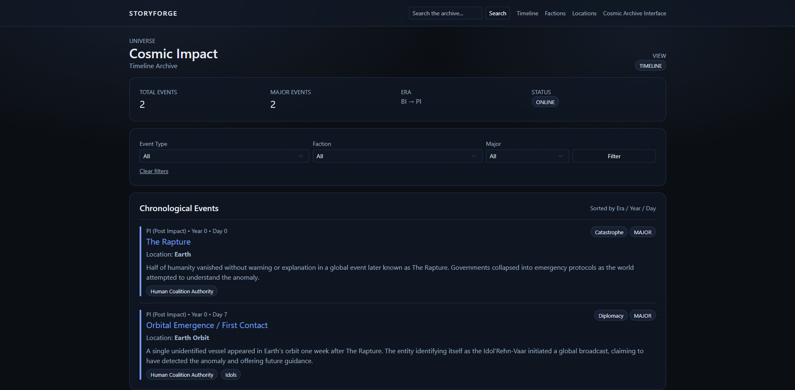
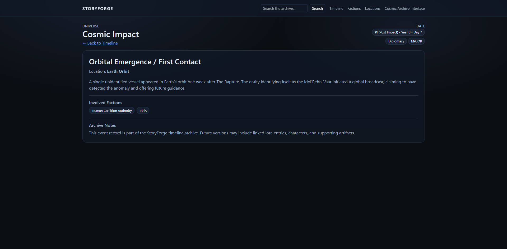
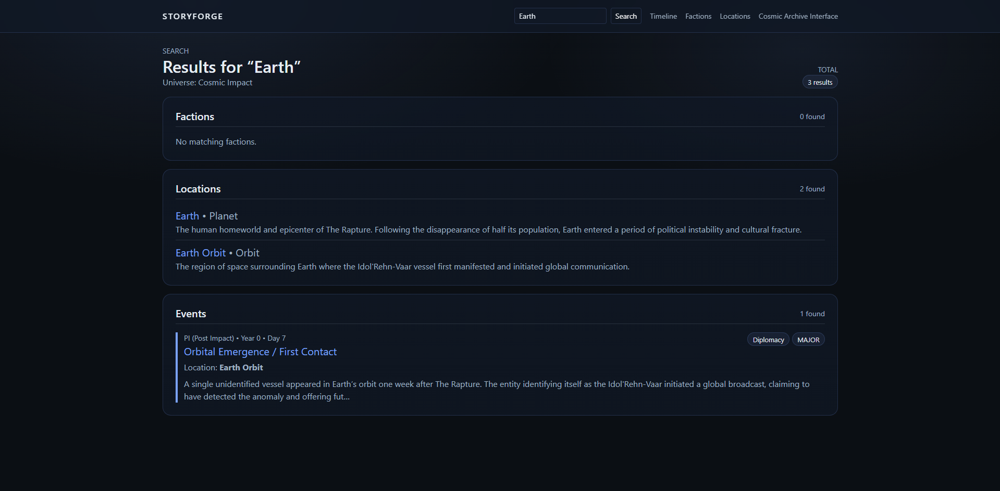
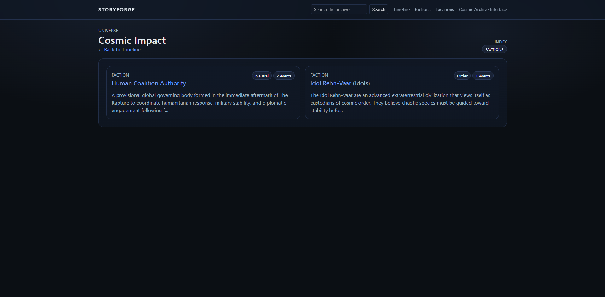
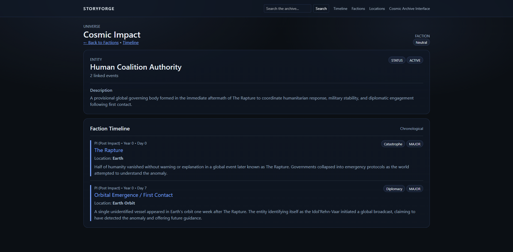
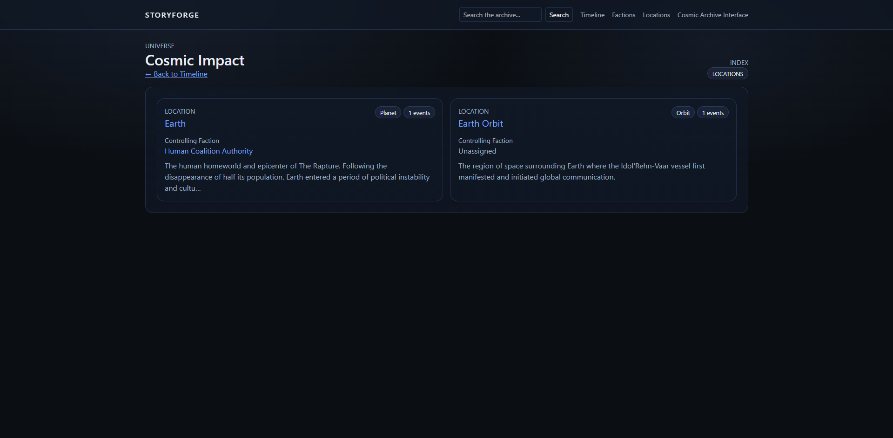
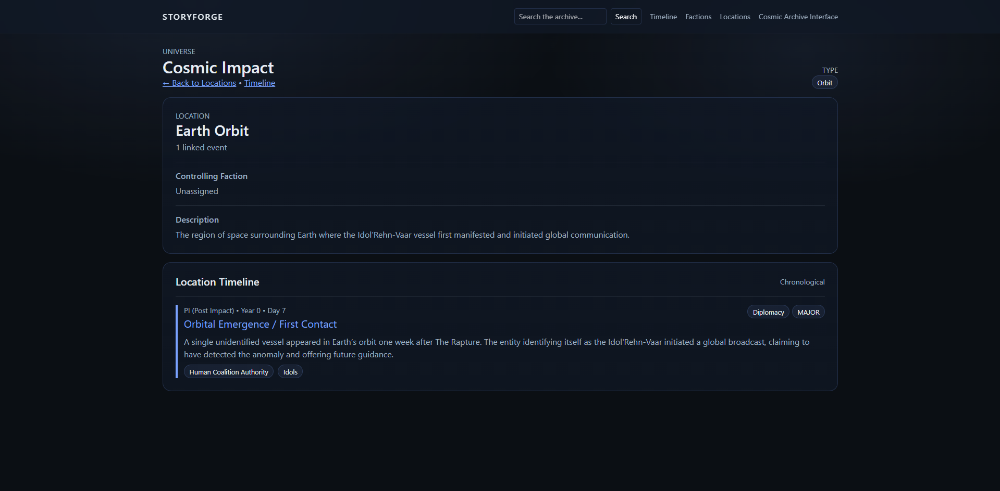

# StoryForge

StoryForge is a dark sci-fi universe management system built with Django. It’s designed to model a fictional universe as structured data — including factions, locations, and timeline events — then present that world through a clean “cosmic archive” interface with filtering and full-text search capabilities.

This capstone project uses **Django Admin as the authoring tool** and a custom front-end for browsing, filtering, and exploring the universe.

---

## Features
- Timeline home view with sortable chronological event feed
- Filters by event type, faction, and “major events”
- Universe-wide search across events, factions, and locations
- Event detail pages with linked factions and locations
- Factions index + faction detail pages with related timeline events
- Locations index + location detail pages with related timeline events
- `seed_demo` command for one-step demo data setup (Cosmic Impact universe)

---

## Demo Data
StoryForge includes a seed_demo management command that populates a demo universe called Cosmic Impact, including factions, locations, and major timeline events.

---

## Screenshots

### Event Timeline














---

## Tech Stack
- Python
- Django
- SQLite (dev)
- HTML/CSS (custom theme) + Bootstrap (light usage)

---

## Roadmap

- Full-text search across events, factions, and locations
- Character and lore modules for expanded universe modeling
- REST API layer for external integrations
- Production deployment with PostgreSQL

---

## Quickstart (Local Setup)
```bash
# 1) Create & activate a virtual environment
python -m venv .venv
# Windows PowerShell:
.venv\Scripts\Activate.ps1

# 2) Install dependencies
pip install -r requirements.txt

# 3) Run migrations
python manage.py migrate

# 4) Create admin user
python manage.py createsuperuser

# 5) Seed demo data
python manage.py seed_demo

# 6) Run server
python manage.py runserver